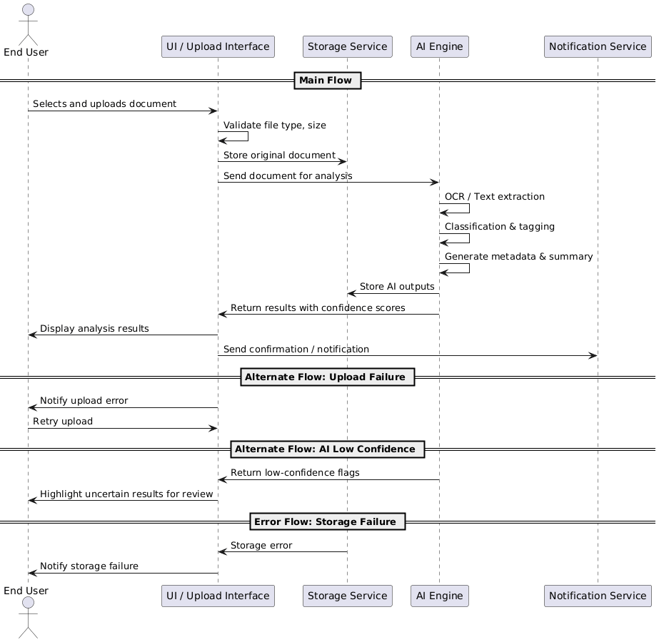
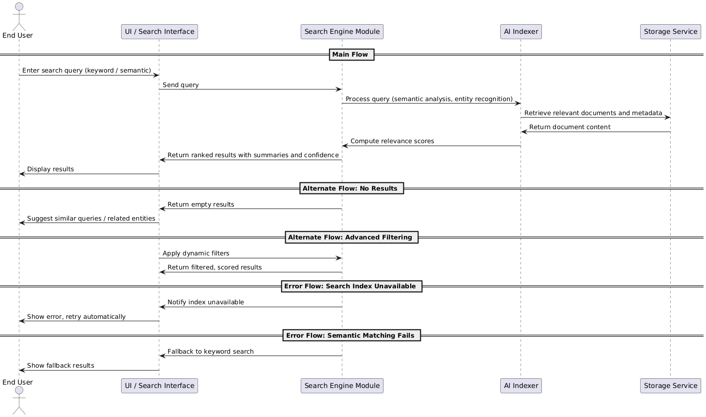
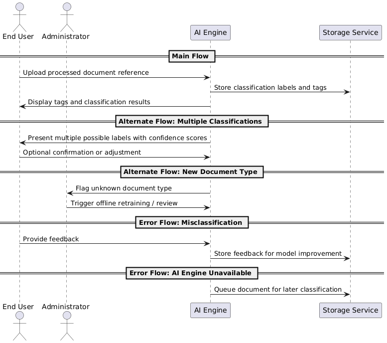
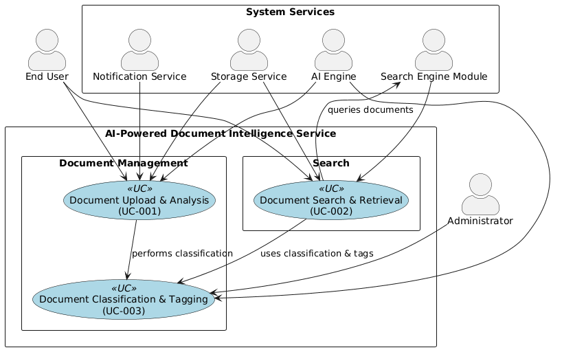

# Use Case Specification

**Project:** AI-Powered Document Intelligence Service  
**Document Version:** 1.1  
**Date:** 2026-01-19  
**Author:** Anil  

---

## Table of Contents

1. [Actors](#actors)  
2. [Use Case UC-001: Document Upload and Analysis](#use-case-uc-001-document-upload-and-analysis)  
3. [Use Case UC-002: Document Search and Retrieval](#use-case-uc-002-document-search-and-retrieval)  
4. [Use Case UC-003: Document Classification & Tagging](#use-case-uc-003-document-classification--tagging)  
5. [AI-Specific Behavior Considerations](#ai-specific-behavior-considerations)  
6. [Use Case Diagram](#use-case-diagram)  

---

## Actors

| Actor | Description |
|-------|-------------|
| End User | Customer, employee, or external client interacting with the system via UI or API |
| AI Document Processing Engine | Core AI module performing extraction, classification, and tagging |
| Storage Service | Stores documents, metadata, and AI outputs |
| Notification Service | Sends confirmations, alerts, or errors to users |
| Search Engine Module | Provides AI-powered semantic and keyword search capabilities |
| Administrator | Monitors system status, reviews flagged documents, manages AI models |

---

## Use Case UC-001: Document Upload and Analysis

**Use Case ID:** UC-001  
**Primary Actor:** End User  
**Secondary Actors:** AI Engine, Storage Service, Notification Service  
**Preconditions:**  
- User is authenticated and authorized.  
- Supported document formats enabled (PDF, DOCX, TXT).  

**Postconditions / Success Guarantees:**  
- Document stored and analyzed.  
- AI-generated metadata, insights, and classifications available.  

### Main Flow
1. User navigates to “Upload Document” interface.  
2. User selects document file.  
3. System validates file format, size, and integrity.  
4. System stores document and generates Document ID.  
5. AI Engine processes the document:  
   - Text extraction (OCR if needed)  
   - Key entity, table, section identification  
   - Metadata, summary, classification generation  
6. AI outputs stored with Document ID.  
7. Results dashboard presented to user with confidence scores.  
8. User confirms or requests further action.

### Alternate Flows
- **AF-1:** Multiple document upload → system validates each, executes processing sequentially or in parallel.  
- **AF-2:** Document exceeds size limit → user notified, can compress or split document.  
- **AF-3:** OCR required → system triggers OCR, verifies extracted text quality.

### Error Flows
- **EF-1:** Upload fails → retry, notify user, log incident.  
- **EF-2:** AI processing fails → document flagged as `Processing Failed`, admin notified, user informed.  
- **EF-3:** Low-confidence extraction → highlighted for user review, optional manual verification.

### Sequence Diagram

---

## Use Case UC-002: Document Search and Retrieval

**Use Case ID:** UC-002  
**Primary Actor:** End User  
**Secondary Actors:** Search Engine Module, AI Indexer, Storage Service  
**Preconditions:**  
- User has repository access.  
- Documents are indexed and processed.  

**Postconditions:**  
- User receives ranked search results with summaries and confidence scores.

### Main Flow
1. User enters search query (keyword, phrase, semantic).  
2. AI Search Engine performs query processing:  
   - Semantic matching & entity recognition  
   - Computes relevance scores  
3. Results presented with metadata, summaries, and confidence/relevance.  
4. User selects documents to view, download, or analyze.

### Alternate Flows
- **AF-1:** No results → system suggests similar queries or related entities.  
- **AF-2:** Advanced filtering → filters applied dynamically, scores displayed.

### Error Flows
- **EF-1:** Search index unavailable → notify user, retry automatically.  
- **EF-2:** Semantic matching fails → fallback to keyword search, log error for retraining.

### Sequence Diagram

---

## Use Case UC-003: Document Classification & Tagging

**Use Case ID:** UC-003  
**Primary Actor:** System (AI Engine)  
**Secondary Actors:** End User, Administrator  
**Preconditions:**  
- Document is uploaded and processed.  

**Postconditions:**  
- Document classified and tagged with AI-generated labels.

### Main Flow
1. AI analyzes document content and metadata.  
2. Assigns classification labels (e.g., invoice, contract, report).  
3. Tags stored in system, visible to user.

### Alternate Flows
- **AF-1:** Multiple possible classifications → multiple tags assigned with confidence scores, user confirmation optional.  
- **AF-2:** New document type → flagged for admin review, offline model retraining triggered.

### Error Flows
- **EF-1:** Misclassification → user feedback recorded for model improvement.  
- **EF-2:** AI engine unavailable → document queued for later classification.

### Sequence Diagram

---

## AI-Specific Behavior Considerations

1. **Probabilistic Outputs**  
   - Confidence scores for all extractions, classifications, and search relevance.  
   - Users can filter results based on thresholds.

2. **Uncertainty Handling**  
   - Low-confidence results trigger manual review or reprocessing.  
   - Thresholds configurable per document type or workflow.

3. **Failure Handling**  
   - Uploads are preserved even if AI fails.  
   - Automatic retry mechanisms with exponential backoff.  
   - System logs errors with context, document IDs, and timestamps.

4. **Feedback Loop / Model Improvement**  
   - User corrections stored and incorporated into offline retraining.  
   - Continuous improvement of extraction, classification, and search models.

---

## Use Case Diagram

