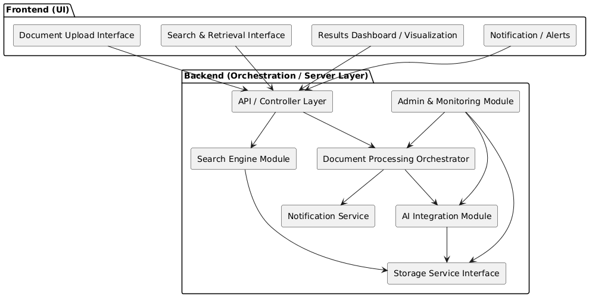
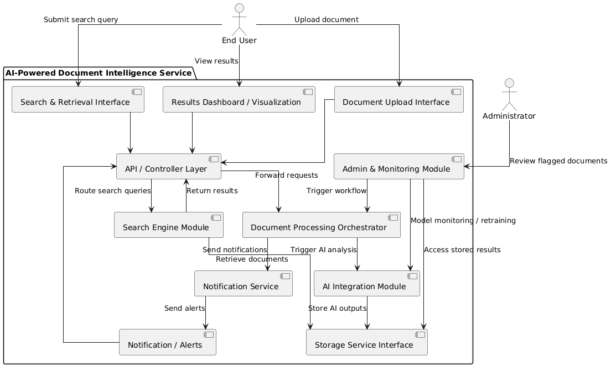

# High-Level Design (HLD)

**Project:** AI-Powered Document Intelligence Service  
**Document Version:** 1.0  
**Date:** 2026-01-20  
**Author:** Anil  

## Introduction

The purpose of this High-Level Design (HLD) document is to provide a detailed view of the system architecture for the AI-Powered Document Intelligence Service. This document translates the functional and non-functional requirements and use case specifications into a modular structure, showing how components interact, where AI processing occurs, and how data flows through the system.  

The HLD serves as a blueprint for development, ensuring that the system is modular, maintainable, and aligned with AI/ML industry best practices. It highlights both user-facing (frontend) and backend components, including AI integration, storage, search, notifications, and administrative monitoring.  

This document also outlines AI-specific considerations such as probabilistic outputs, uncertainty handling, feedback loops, and failure recovery mechanisms, which are critical for AI-powered services.

## Modules / Components

### Frontend (Presentation Layer / UI)

The frontend is the **user-facing part of the system**, responsible for allowing users to interact with the document intelligence service. It handles input, displays results, and provides visualization of AI outputs. The frontend modules include:

1. **Document Upload Interface [Frontend / UI]**  
   This module allows users to select and upload documents. It validates document formats (PDF, DOCX, TXT) and size limits, and provides immediate feedback to the user in case of errors. The uploaded documents are sent to the backend via API calls.

2. **Search & Retrieval Interface [Frontend / UI]**  
   This module allows users to perform semantic or keyword-based searches. It displays ranked results along with summaries and confidence scores returned from the backend search engine module. Users can apply filters and advanced search options through this interface.

3. **Results Dashboard / Visualization [Frontend / UI / Visualization Layer]**  
   The dashboard presents AI-generated metadata, classifications, tags, and confidence scores. Low-confidence or ambiguous outputs are highlighted for user review. Users can drill down into document details and request further analysis.

4. **Notification / Alerts [Frontend / UI]**  
   This module displays system notifications such as successful uploads, processing errors, or alerts generated by AI confidence thresholds. It ensures that users are always informed about the status of their interactions.

### Backend (Orchestration / Server Layer)

The backend orchestrates core processing, manages data storage, and integrates AI models. It is responsible for the **heavy-lifting logic** and ensures reliable, secure, and scalable system operations. The backend modules include:

1. **API / Controller Layer [Backend / API Layer]**  
   This layer receives requests from the frontend, validates inputs, handles authentication and authorization, and routes requests to the appropriate backend services.

2. **Document Processing Orchestrator [Backend / Workflow Manager]**  
   This module manages the end-to-end workflow of documents: storing uploaded documents, triggering AI analysis, persisting results, and notifying the frontend. It ensures proper sequencing, handles parallel processing, and logs workflow events.

3. **AI Integration Module [Backend / AI / Model Serving Layer]**  
   Responsible for interfacing with AI models for text extraction, classification, tagging, and scoring. It returns structured results along with confidence levels and flags low-confidence outputs for review.

4. **Storage Service Interface [Backend / Data Layer]**  
   Provides persistent storage for original documents, AI-generated metadata, tags, classifications, and search indices. Ensures efficient retrieval and versioning.

5. **Search Engine Module [Backend / Search / Retrieval Layer]**  
   Handles semantic and keyword searches over stored documents. Maintains indices for fast retrieval and calculates relevance scores for results.

6. **Notification Service [Backend / Messaging Layer / Event Notification]**  
   Sends confirmations, alerts, or error messages back to the frontend. Supports asynchronous notifications for long-running processes.

7. **Admin & Monitoring Module [Backend / Monitoring / Admin Layer]**  
   Monitors system health, tracks processing queues, evaluates AI model performance, and supports administrative review of flagged documents. Logs system events and facilitates feedback loops for retraining.

## Module Interactions

The system modules interact in a structured manner to ensure smooth document processing, AI analysis, and result delivery to users. The interactions are described below:

### Frontend ↔ Backend Interaction

Users interact with the system via the frontend UI. When a user uploads a document, the **Document Upload Interface** sends the file to the **API / Controller Layer**. The API layer validates the file, authenticates the user, and forwards it to the **Document Processing Orchestrator** for processing. The orchestrator manages the workflow, including triggering AI analysis, storing results, and notifying the frontend of completion or errors. The **Results Dashboard** and **Notification / Alerts** modules display results, confidence scores, and system messages back to the user.

### AI Processing Flow

The **AI Integration Module** performs document text extraction, classification, tagging, and scoring. Confidence scores and probabilistic outputs are generated for each processed document. Low-confidence outputs are flagged for review and may trigger additional processing or human verification. AI results are stored in the **Storage Service Interface** for persistent access and future retrieval.

### Search Flow

For document search, the **Search & Retrieval Interface** sends queries to the **API / Controller Layer**, which routes them to the **Search Engine Module**. The search engine queries indexed documents in storage, applies semantic and keyword matching, computes relevance scores, and returns results to the frontend for display.

### Admin / Monitoring Flow

The **Admin & Monitoring Module** continuously observes system health, AI processing queues, and model performance metrics. Administrators can review flagged documents, adjust processing parameters, and monitor system logs. Feedback collected during manual review is stored and used to improve AI models through retraining, completing the feedback loop.

These interactions ensure that the system operates reliably, handles errors gracefully, and delivers AI-powered insights to users efficiently.

## AI-Specific Considerations

The AI-Powered Document Intelligence Service has unique considerations due to the probabilistic nature of AI outputs. These include handling confidence scores, uncertainty, failures, and incorporating user feedback for continuous improvement.

### Probabilistic Outputs and Confidence Scores

All AI outputs, including text extraction, classification, and tagging, include confidence scores. These scores represent the system’s certainty about the prediction or extraction. Users can filter results based on confidence thresholds, and low-confidence results are highlighted in the frontend dashboard for optional manual review.

### Uncertainty Handling

Documents or document segments with low-confidence AI outputs are flagged for additional review. This may involve reprocessing with alternate AI models, applying OCR enhancement, or triggering human-in-the-loop verification. Thresholds for uncertainty handling are configurable per document type and workflow.

### Failure Handling

The system ensures robustness by implementing the following failure handling mechanisms:  
- Uploads are preserved even if AI processing fails.  
- Automatic retry mechanisms are applied for failed AI tasks, with exponential backoff.  
- Errors are logged with context, document IDs, timestamps, and relevant workflow state.  
- Notifications are sent to users in case of failures, maintaining transparency.

### Feedback Loop and Model Improvement

User corrections, manual reviews, and flagged errors are stored in the system to facilitate retraining of AI models. The feedback loop ensures that models improve over time, incorporating edge cases and real-world usage patterns. Administrative monitoring allows review of AI performance metrics, enabling periodic updates and improvements.

### Summary

These AI-specific considerations ensure that the system provides reliable, interpretable, and continuously improving AI-powered document intelligence, while maintaining usability and trust for end users.

## Component Diagram 

The following component diagram illustrates the system modules, their responsibilities, and interactions between frontend UI, backend orchestration, AI processing, storage, search, notifications, and admin modules.

 

## High-Level Data Flow Diagram (DFD)

The following diagram illustrates the flow of documents, data, and interactions between users, system modules, AI processing, storage, search, and notifications within the AI-Powered Document Intelligence Service.

